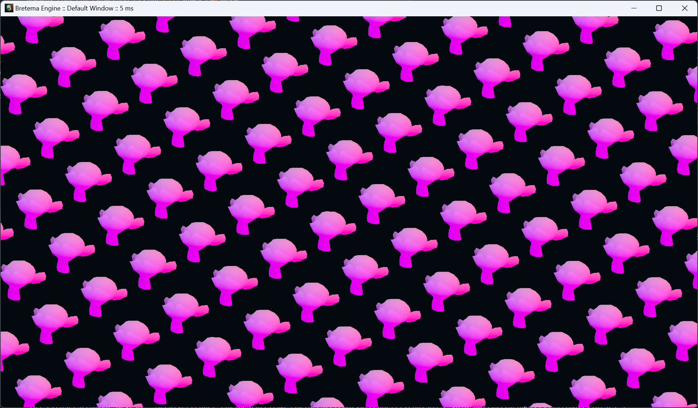

# 🧊 Bretema Engine

### 🛠️ How to build it

```bash
git clone https://github.com/byBretema/bretema
cd bretema
git submodule update --init --recursive
python ./build.py -b  # This expects that you have g++ installed
./build/main.exe
```

### 📸 Demo



### 🕹️ Demo Controls
- Move around
    - `W / S` : Forward / Backward
    - `A / D` : Left / Right
    - `Q / E` : Up / Down
- Camera [^1]
    - `R` : Restarts camera position
    - `Click + Drag` : Move camera arround
    - `Wheel` : "Zoom" or FOV if `F` is pressed
    - `O` : Toggle camera Orbital / Fly modes
    - `,` : Toggle Isometric view (*it's the comma character*)

[^1]: Camera transtions preserve LookAt between all modes so transtion is as smooth as possible
